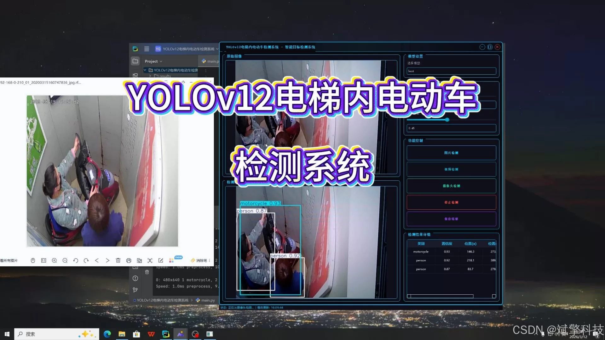
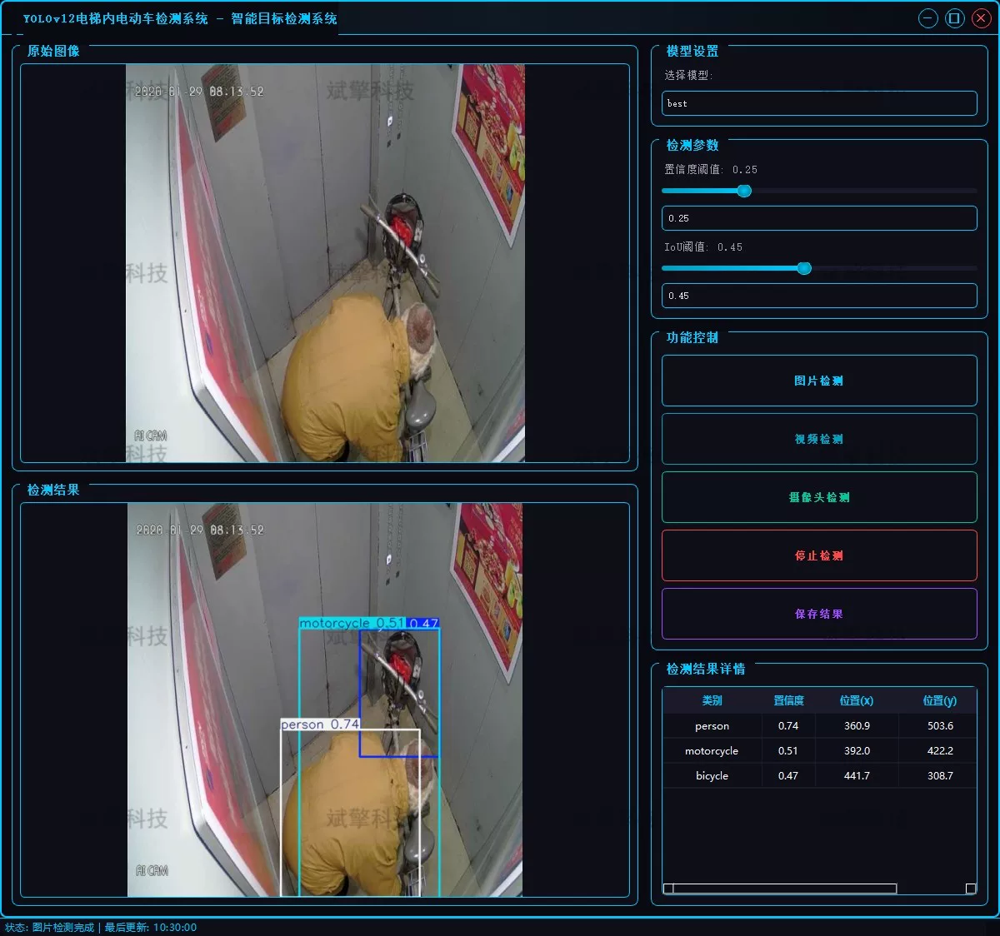
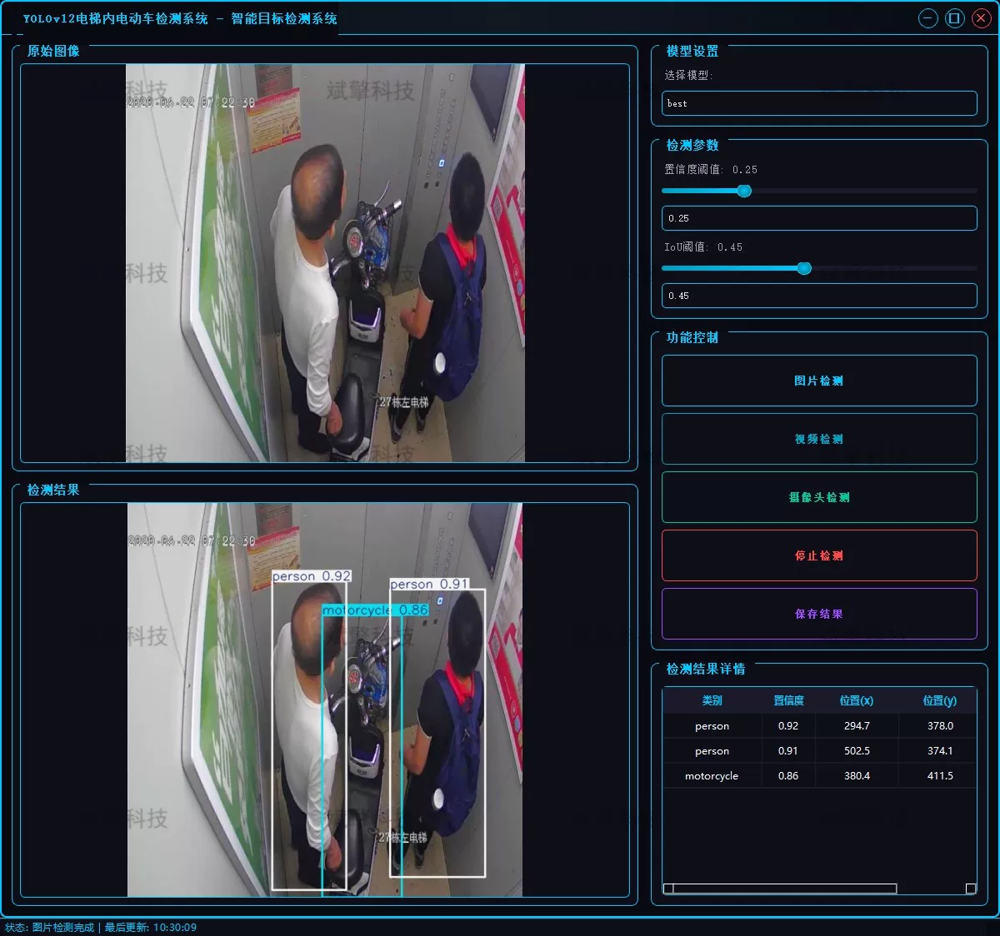
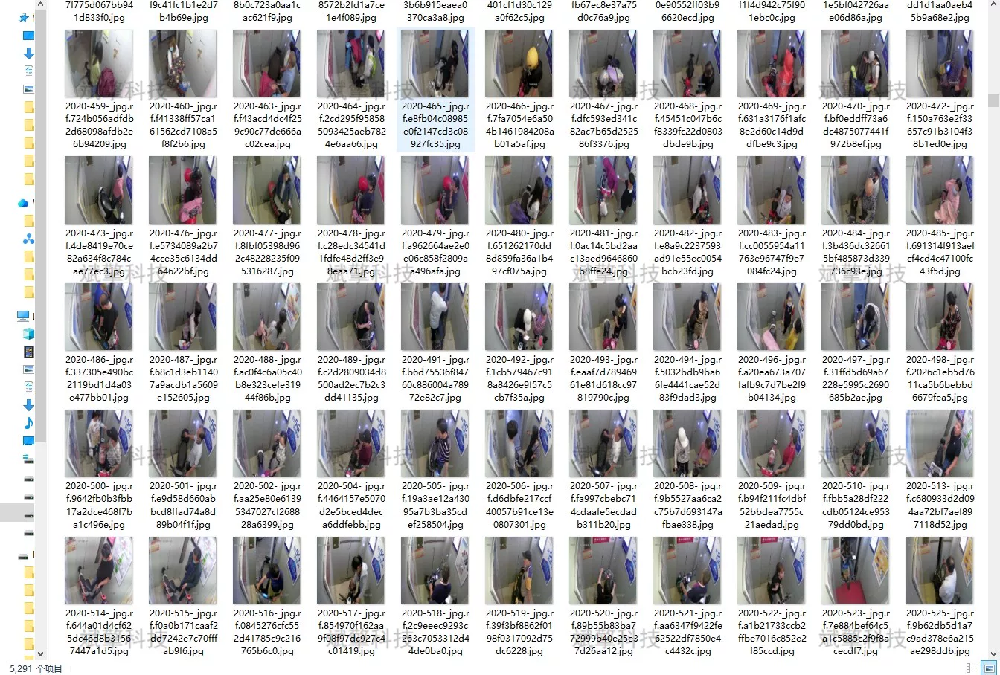
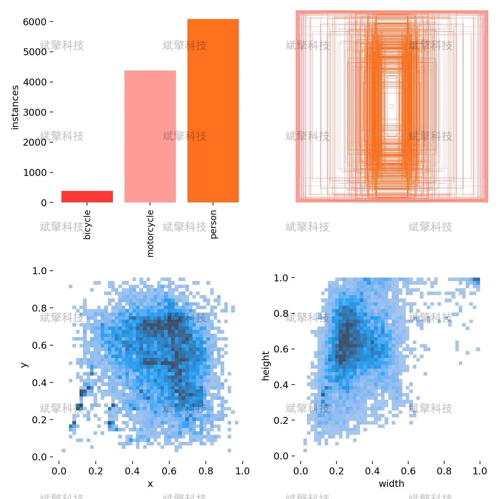
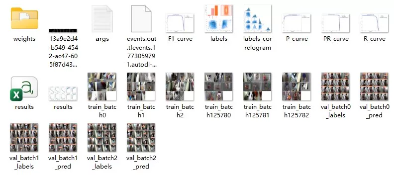
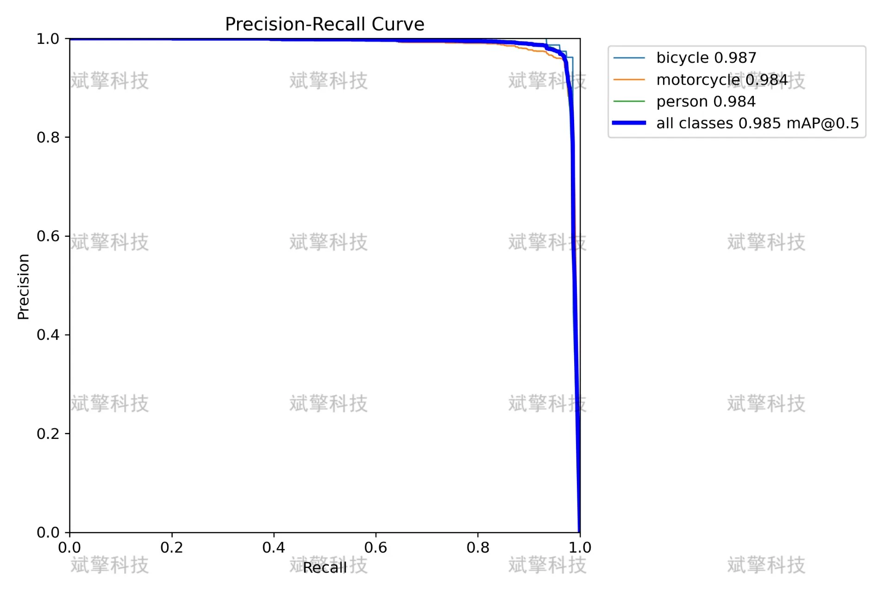
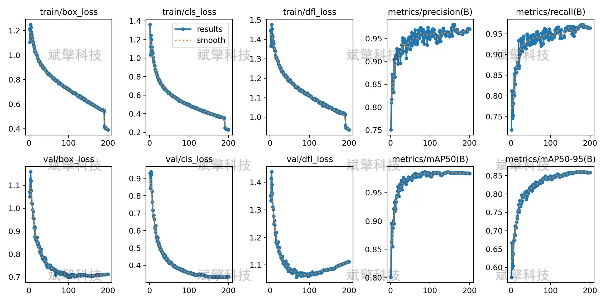
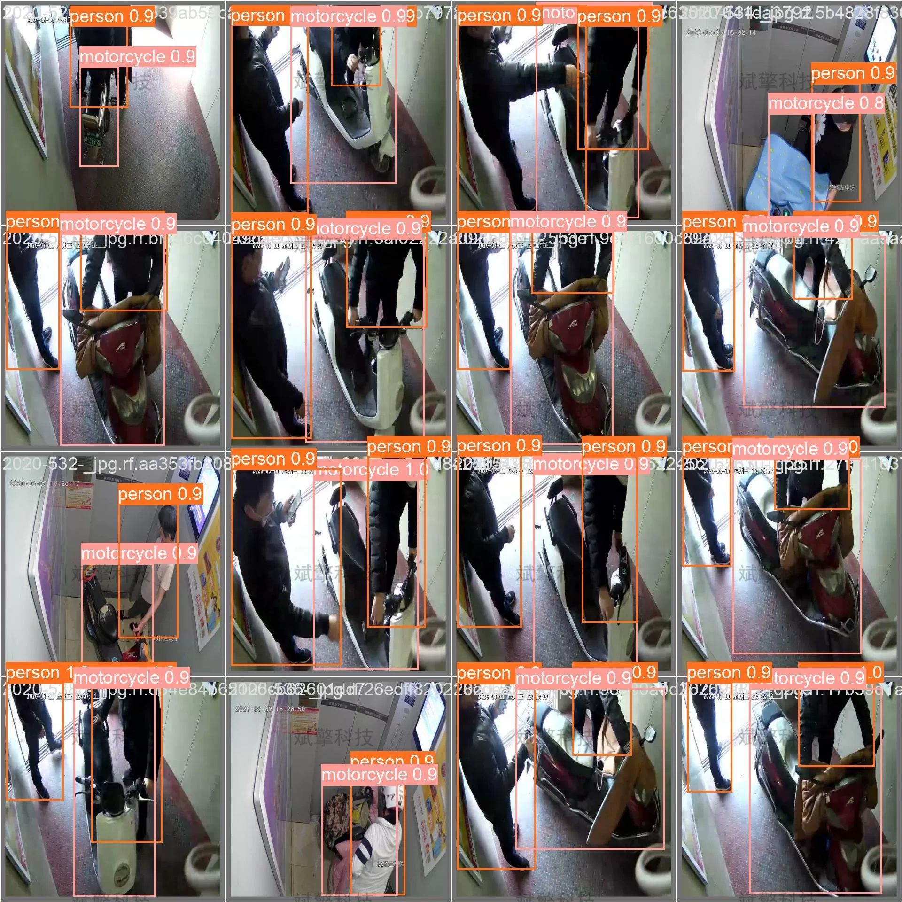

# Elevator Inside E-bike Detection System Based on Deep Learning YOLOv12

## Body

Based on the latest YOLOv12 object detection algorithm, a high-efficiency and precise electric vehicle entry detection system for elevators has been designed and implemented.

This system can identify and locate three types of targets in elevator surveillance footage: bicycles, motorcycles, and people. It supports image, video files, and real-time camera video stream detection modes. Once an electric vehicle enters the elevator, the system will immediately trigger an alarm mechanism. Experimental results show that the YOLOv12 model trained on large datasets has high accuracy and strong robustness in complex elevator environments, providing reliable technical support for intelligent security and elevator intelligent management.

System Function Overview

✅ User Login and Registration: Supports password verification and security validation.

✅ Three Detection Modes: Based on the YOLOv12 model, supports image, video, and real-time camera detection, accurately identifying targets.

✅ Dual Screen Comparison: Displays the original scene and detection results on the same screen.

✅ Data Visualization: Real-time table displays the category, confidence, and coordinates of detected targets.

✅ Intelligent Parameter Tuning: Offers a confidence slide bar to dynamically optimize detection accuracy, adapting to different scene needs.

✅ Sci-Fi Style Interaction Interface: Dark theme combined with dynamic light effects, reducing visual fatigue and improving operational experience.

✅ Multi-thread High-Performance Architecture: Independent detection threads ensure smooth operation, real-time status prompts, and rapid response without lag.

Dataset Introduction

Training set: 5291 images, used for model learning and feature extraction.
Validation set: 1168 images, used for adjusting model hyperparameters and initial performance verification.
Test set: 652 images, as completely unseen data, used for final evaluation of the model's accuracy and robustness.

## Images

## Payment

Here is a pay link on Stripe ( https://buy.stripe.com/3cs8yP7sY87d0vu9AB ). Please contact me lonlonago@foxmail.com after funding $89, and I will send you a complete data files , thank you!

